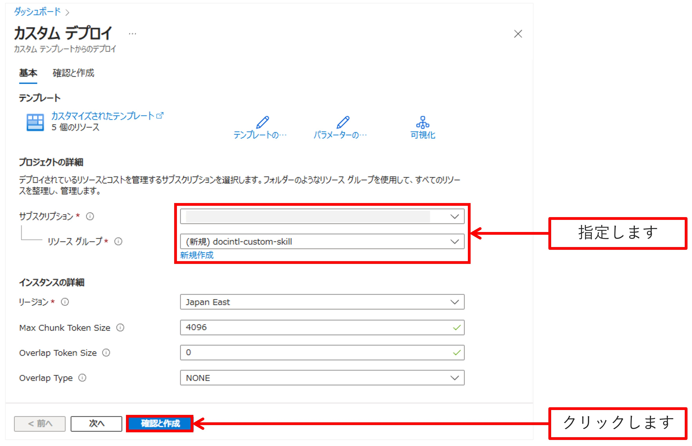
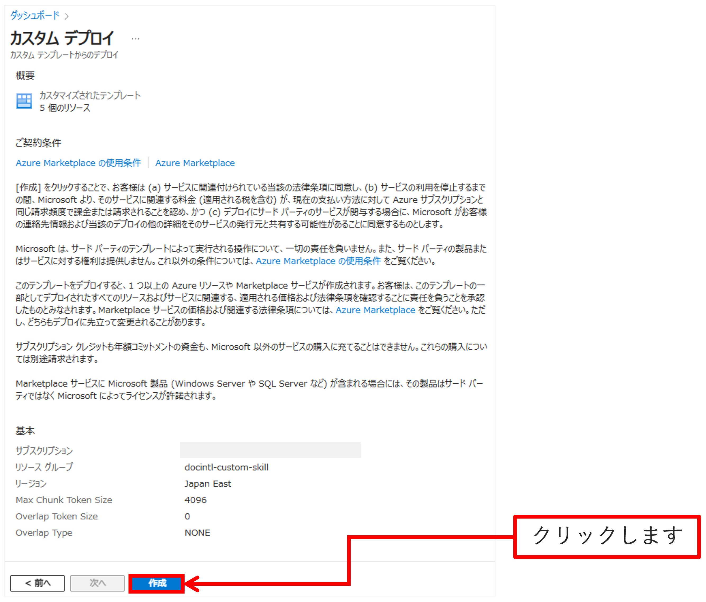
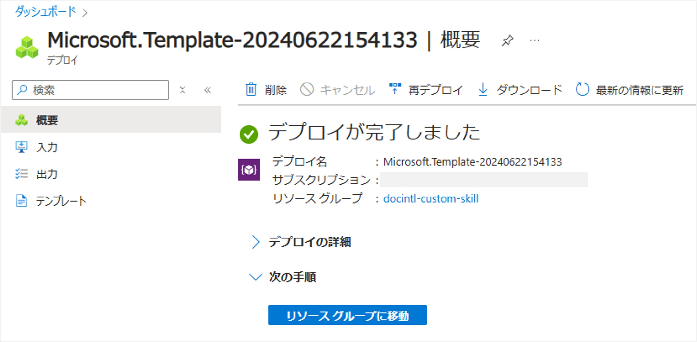
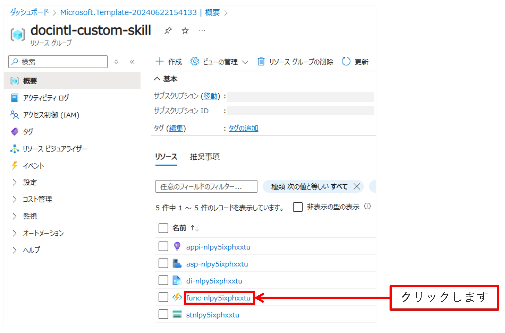
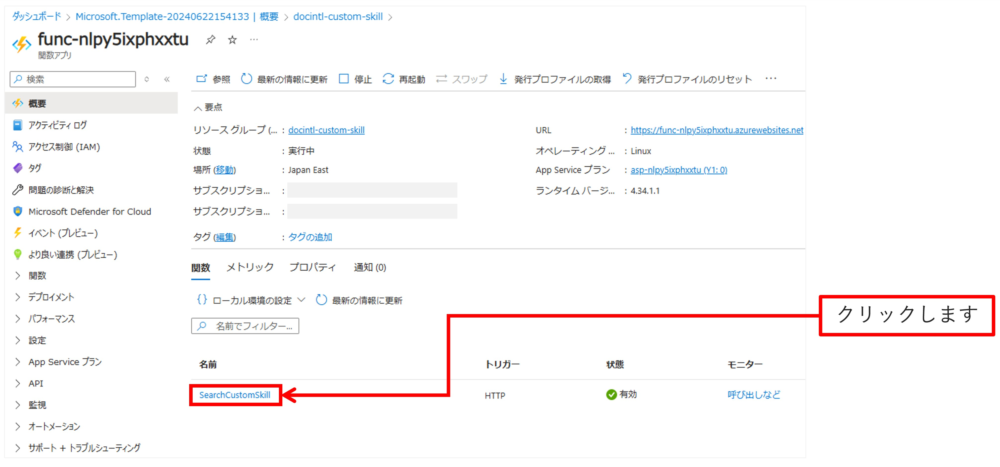
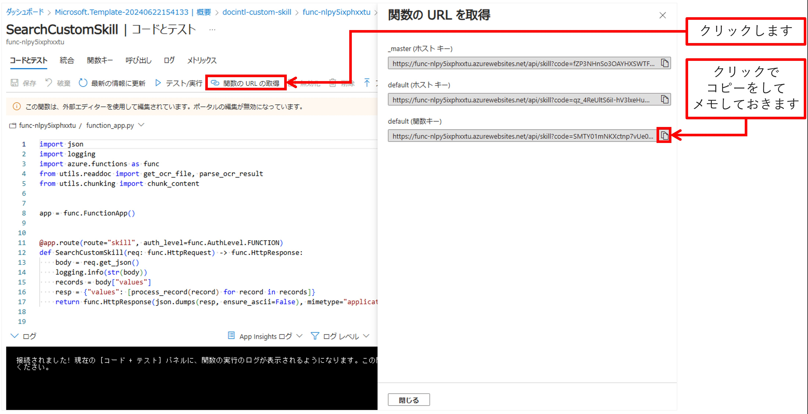
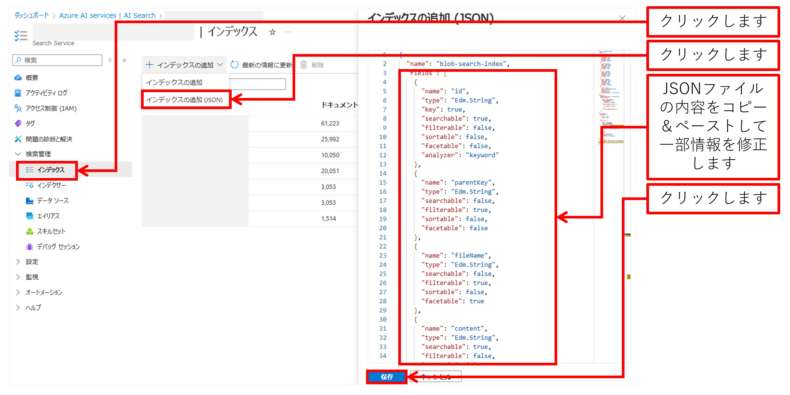

# Azure AI Search - Document Intelligence Skill
[Azure AI Search](https://learn.microsoft.com/ja-jp/azure/search/search-what-is-azure-search) の[スキルセットのカスタム Web API スキル](https://learn.microsoft.com/ja-jp/azure/search/cognitive-search-custom-skill-web-api)にて使用するための Azure Functions アプリをデプロイして使用するためのコードです。  
  
本コードでできるカスタム Web API スキルは、Azure AI Search が [Azure Blob Storage](https://learn.microsoft.com/ja-jp/azure/search/search-howto-indexing-azure-blob-storage) から収集した、PDF ファイルや Office ファイルを [Azure AI Document Intelligence](https://learn.microsoft.com/ja-jp/azure/ai-services/document-intelligence/overview?view=doc-intel-4.0.0) で OCR 分析をして、抽出したテキストをチャンク分割をしてくれます。

## 使い方

### カスタム Web API スキルのデプロイ

以下のボタンをクリックすることで、簡単に必要な Azure リソースをデプロイすることができます。

[](https://portal.azure.com/#create/Microsoft.Template/uri/https%3A%2F%2Fraw.githubusercontent.com%2Fmahiya%2Fdocument-intelligence-search-skill%2Fmain%2Fazuredeploy.json)

ボタンをクリックすると、Azure Portal のカスタムデプロイのページが表示されます。  


Azure リソースをデプロイする先の [Azure サブスクリプション]と[リソースグループ]を選択して、[確認と作成]ボタンをクリックします。  
```Max Chunk Token Size``` はチャンク分割する際、分割されたチャンクの最大トークンサイズです。```Overlap Token Size``` はチャンク間で文言をオーバラップさせる際のオーバラップ分のトークンサイズです。```Overlap Type```はオーバラップをさせる際のオーバラップの仕方で、```NONE```はオーバラップさせない、```PRE```は前の文章のみをオーバラップさせる、```POST```は後の文章のみをオーバラップさせる、```PREPOST```は前と後の文章をオーバラップさせる動作となります。


[作成]ボタンをクリックして、デプロイを開始します。デプロイを開始すると、以下の Azure サービスのリソースのデプロイが行われます。
- Azure Functions (カスタム Web API スキルのプログラムの稼働)
- Azure App Service Plan (Functions アプリのホスト)
- Azure Application Insights (Functions アプリの監視とログ管理)
- Azure Storage (Functions アプリコードの格納)
- Azure AI Document Intelligence (処理対象のファイルのOCR分析)


この画面が表示されれば、デプロイが成功しています。

### カスタム Web API スキルの使い方
カスタム Web API スキルを使用するために、まずデプロイした Azure Functions アプリの ```SearchCustomSkill``` という名前の関数の関数キー付きのURLを取得する必要があります。取得するために、Azure Portal にてデプロイした Azure Function アプリのページを表示します。  
  
Azure Function アプリのページを表示するために、デプロイ先の Azure リソースグループのページを表示し、デプロイした Azure Function アプリの名前をクリックします。


デプロイされている HTTP トリガーである ```SearchCustomSkill``` 関数をクリックします。


関数の詳細ページが表示されます。ここでログストリームの閲覧や簡単なテストを行うことができます。[関数の URL の取得]をクリックすると、画面右に関数の URL が表示されるので、```default(関数キー)``` として表示されている関数キー付きの URL をコピーしてメモしておきます。


Azure AI Search のスキルセットにて、以下の通りにスキルセットを定義することにより、今回デプロイしたカスタム Web API スキルを使用することができます。スキルへの入力(```inputed```)には、必ず処理対象の Azure Blob の URL (```metadata_storage_path```) とアクセスするための一時アクセスキー(```metadata_storage_sas_token```)を入力してください (以下の通りに書けば問題ありません)。

```json
{
    "name": "",
    "skills": [
        {
            "@odata.type": "#Microsoft.Skills.Custom.WebApiSkill",
            "uri": "{{ Azure Functions にデプロイしたカスタムスキルのエンドポイント }}",
            "batchSize": 1,
            "timeout": "PT230S",
            "inputs": [
                {
                    "name": "metadata_storage_path",
                    "source": "/document/metadata_storage_path"
                },
                {
                    "name": "metadata_storage_sas_token",
                    "source": "/document/metadata_storage_sas_token"
                }
            ],
            "outputs": [
                {
                    "name": "output",
                    "targetName": "chunks"
                }
            ]
        },
        ...
    ]
}
```

カスタムスキルは出力```output```として、以下のような配列を返します。
```json
[
    {"content": "チャンクされた文章 1"},
    {"content": "チャンクされた文章 2"},
    {"content": "チャンクされた文章 3"},
    ...
]
```

カスタム Web API スキルのコードは [srcフォルダ](./src)配下に格納されています。

## 使い方の例
[searchフォルダ](./search)配下に格納されている JSON ファイルは、本カスタム Web API スキルを使うための、Azure AI Search のインデックス([index.json](./search/index.json))、インデクサー([indexer.json](./search/indexer.json))、データソース([datasource.json](./search/datasource.json))、スキルセット([skillset.json](./search/skillset.json))の定義の例です。  
  
各要素の作成は、Azure Portal 上で行うことができます。各 JSON ファイルの内容を適宜修正して、フィールドへコピー＆ペーストをすることで行うことができます。作成は、インデックス、データソース、スキルセット、インデクサーの順で行う必要があります (※ただし、インデックスとデータソースについてのみどちらを先に行っても問題ありません)

### 1. インデックスの作成

使用する Azure AI Search アカウントのページを表示して、サイドメニューの[検索管理]>[インデックス]をクリックし、上部メニューの[＋インデックスの追加]>[インデックスの追加(JSON)]を選択すると、画面右側にJSONでインデックスを追加するためのフィールドが表示されるため、[index.json](./search/index.json) の内容をコピー＆ペーストします。  
  
このままだと正しく動作しないため、以下の箇所を修正します。
- ```vectorizers.azureOpenAIParameters.resourceUri``` の値に、使用する Azure OpenAI Service アカウントのエンドポイント(text-embedding-3-largeモデルがデプロイされているアカウント)を指定
- ```vectorizers.azureOpenAIParameters.apiKey``` の値に、使用する Azure OpenAI Service アカウントのキーを指定
- ```vectorizers.azureOpenAIParameters.deploymentId``` の値に、使用する Azure OpenAI Service アカウントでの text-embedding-3-large モデルのデプロイ名を指定
   
```json
"vectorizers": [
    {
        "name": "azureOpenAI",
        "kind": "azureOpenAI",
        "azureOpenAIParameters": {
            "resourceUri": "{{ 使用する Azure OpenAI Service のエンドポイント }}",
            "apiKey": "{{ 使用する Azure OpenAI Service のキー }}",
            "deploymentId": "{{ 使用する Azure OpenAI Service のデプロイ名 }}",
            "modelName": "text-embedding-3-large"
        }
    }
],
```

修正をしたら、[保存]ボタンをクリックしてインデックスを追加します。



### 2. データソースの作成
サイドメニューの[検索管理]>[データソース]をクリックし、上部メニューの[＋データソースの追加]をクリックします。すると、[データソースの追加]の画面が表示されるため、[データソース定義(JSON)]タブをクリックし、JSONでデータソースを追加するためのフィールドに [datasource.json](./search/datasource.json) の内容をコピー＆ペーストします。  
  
このままだと正しく動作しないため、以下の箇所を修正します。
- ```credentials.connectionString``` の値に、Azure AI Search に格納するファイルを格納している Azure Storage アカウントの接続文字列を指定
- ```container.name``` の値に、ファイルを格納している Azure Storage アカウント内のコンテナの名前を指定 
  
```json
{
    "name": "blob-source",
    "type": "azureblob",
    "credentials": {
        "connectionString": "{{使用する Azure Blob Storage の接続文字列}}"
    },
    "container": {
        "name": "{{使用する Azure Blob Storage のコンテナ名}}"
    }
}
```

修正をしたら、[保存]ボタンをクリックしてデータソースを追加します。

> 参考: [ストレージ アカウントの構成情報を取得する - Azure Storage | Microsoft Learn](https://learn.microsoft.com/ja-jp/azure/storage/common/storage-account-get-info?tabs=portal)

### 3. スキルセットの作成
サイドメニューの[検索管理]>[スキルセット]をクリックし、上部メニューの[＋スキルセットを追加]をクリックします。すると、[スキルセットを追加]の画面が表示されるため、[データソース定義(JSON)]タブの JSON でスキルセットを追加するためのフィールドに [skillset.json](./search/skillset.json) の内容をコピー＆ペーストします。  
  
このままだと正しく動作しないため、以下の箇所を修正します。
- ```skills```内にある```#Microsoft.Skills.Custom.WebApiSkill```スキルの```url``` の値に、上記でメモした Azure Functions にデプロイしたカスタム Web API スキルのURLを指定

- ```skills```内にある```#Microsoft.Skills.Text.AzureOpenAIEmbeddingSkill```スキルの```resourceUri``` の値に、使用する Azure OpenAI Service アカウントのエンドポイント(text-embedding-3-largeモデルがデプロイされているアカウント)を指定
- ```skills```内にある```#Microsoft.Skills.Text.AzureOpenAIEmbeddingSkill```スキルの```apiKey``` の値に、使用する Azure OpenAI Service アカウントのキーを指定
- ```skills```内にある```#Microsoft.Skills.Text.AzureOpenAIEmbeddingSkill```スキルの```deploymentId``` の値に、使用する Azure OpenAI Service アカウントでの text-embedding-3-large モデルのデプロイ名を指定
   

```json
"skills": [
        {
            "@odata.type": "#Microsoft.Skills.Custom.WebApiSkill",
            "uri": "{{ Azure Functions にデプロイしたカスタムスキルのエンドポイント }}",
            ...
        },
        {
            "@odata.type": "#Microsoft.Skills.Text.AzureOpenAIEmbeddingSkill",
            "context": "/document/chunks/*",
            "resourceUri": "{{ 使用する Azure OpenAI Service のエンドポイント }}",
            "apiKey": "{{ 使用する Azure OpenAI Service のキー }}",
            "deploymentId": "text-embedding-3-large",
            "modelName": "text-embedding-3-large",
            ...
        }
    ],
```

修正をしたら、[保存]ボタンをクリックしてスキルセットを追加します。

### 4. インデクサーの作成
サイドメニューの[検索管理]>[インデクサー]をクリックし、上部メニューの[＋インデクサーの追加]をクリックします。すると、[インデクサーの追加]の画面が表示されるため、[インデクサー定義(JSON)]タブをクリックし、JSON でインデクサーを追加するためのフィールドに [indexer.json](./search/indexer.json) の内容をコピー＆ペーストします。 
  
 [保存]ボタンをクリックしてインデクサーを追加すると、インデクサーが自動で起動し、指定したデータソース先に格納されているファイルを処理し始めます。インデクサーの実行が成功すると、インデックスに取り込んだファイルが、チャンク分割された形で格納されています。